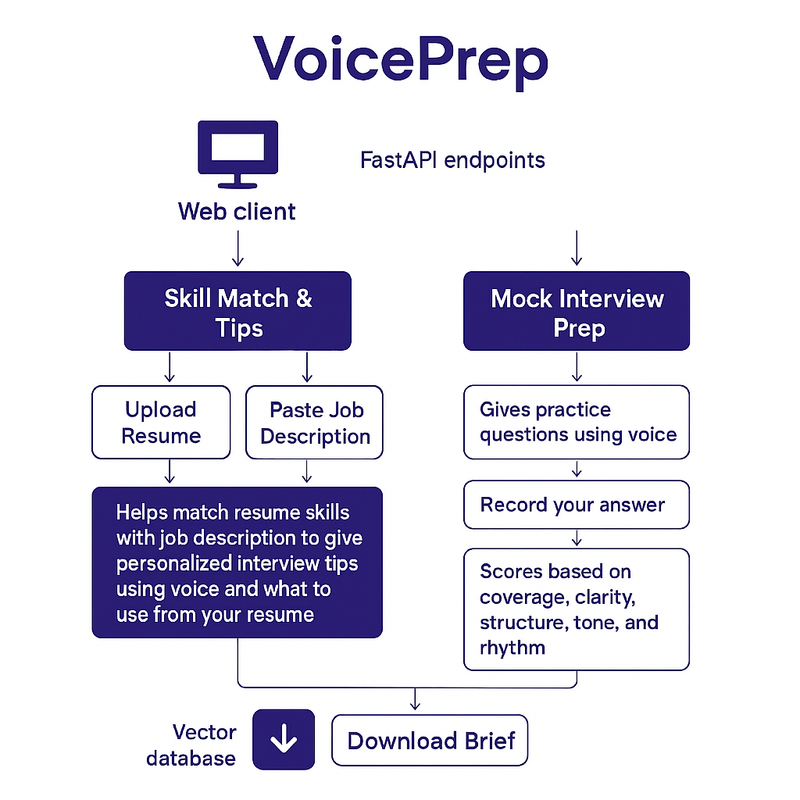

# 🗣️ VoicePrep AI – AI-Powered Voice Interview Practice Agent  

> “Improve your delivery, structure, and clarity — not just your content.”

VoicePrep AI is a **voice-enabled interview-practice agent** that helps users improve how they *sound* in interviews.  
It listens to your answers, analyzes **clarity**, **structure**, and **coverage**, and gives personalized feedback.  
Built with **FastAPI**, **spaCy**, and **scikit-learn**, it offers real-time, rubric-based coaching for interview readiness.

🌐 **Live Demo:** [https://voiceprep-ai-1.onrender.com](https://voiceprep-ai-1.onrender.com)  

---

## Features

### Real-Time Interview Practice
- Speak directly through a simple browser interface.  
- System transcribes and scores your spoken answer.

### Smart Feedback Engine
- **spaCy** for linguistic clarity and tone analysis.  
- **TF-IDF + Cosine Similarity** (scikit-learn) to measure structure and coverage.  
- Generates actionable tips such as “Add a concrete example” or “Tighten your intro.”

### Rubric-Based Scoring
| Criterion | What it Measures |
|------------|------------------|
| **Clarity** | Conciseness and intelligibility |
| **Structure** | Logical flow, transitions, conclusion |
| **Coverage** | Completeness and relevance |

### 🧩 Modular Architecture
- Organized routers (`live.py`, `match.py`, `qa.py`, etc.)  
- Configurable scoring weights and rubric logic  
- Graceful error handling and conversational state retention  

---

## 🏗️ Architecture

